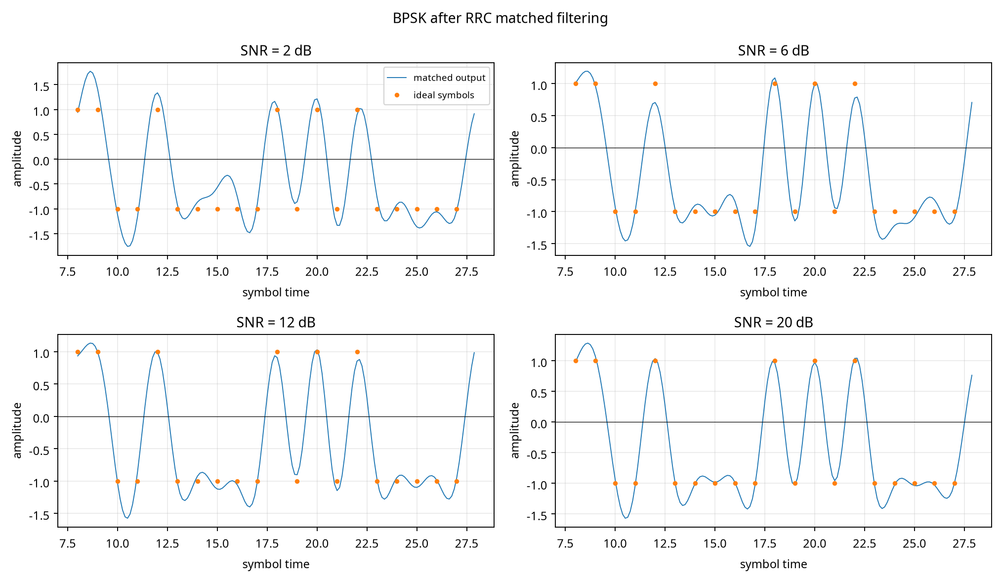
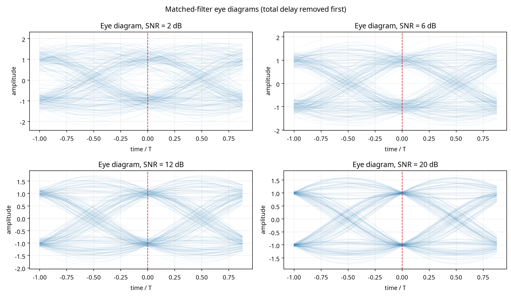
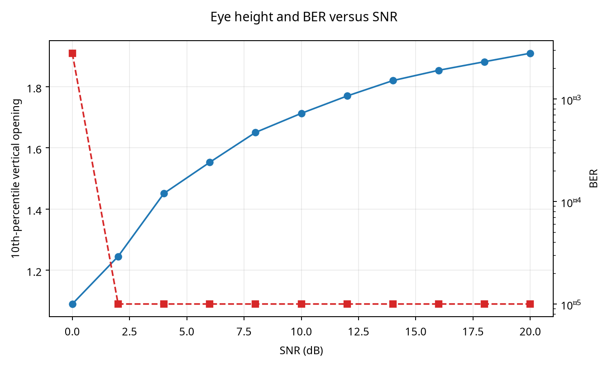
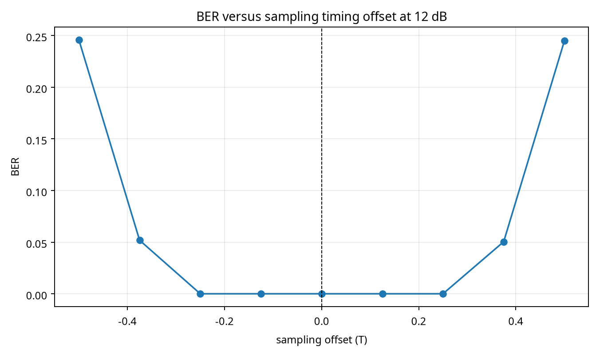
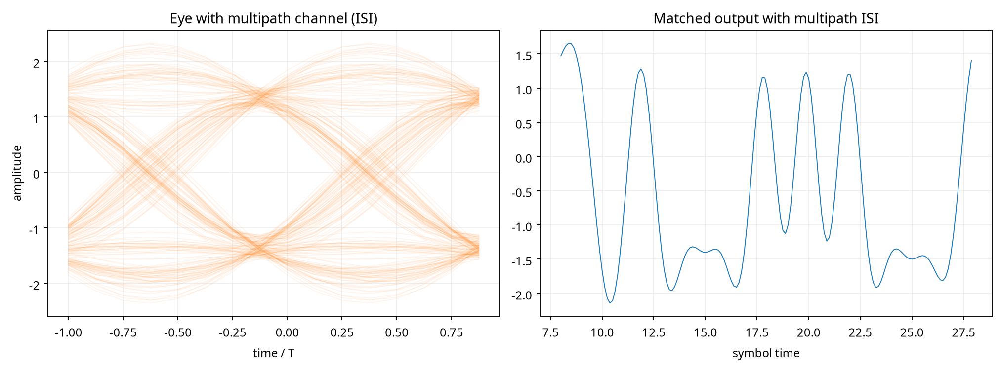

# Experiment 8 — Matched Filtering, ISI, and Eye Diagrams

## Conclusion

The simulation demonstrates that the receive RRC filter is a matched filter for the transmit RRC pulse. With the total cascade delay removed, the nominal symbol samples occur at indices `total_delay + k·sps`; sampling there gives a clean BPSK decision statistic. Noise reduces eye height and increases BER, timing offsets close the eye, and multipath creates intersymbol interference (ISI) even when the additive noise is small.

## Implementation

The experiment uses BPSK symbols, an explicitly coded unit-energy root-raised-cosine (RRC) pulse, convolution for transmit shaping, real additive white Gaussian noise, and a time-reversed RRC receive filter. No communications toolbox is used. The default parameters are `sps=8`, roll-off `β=0.35`, and span `10` symbols. The RRC filter has `81` taps.

The reusable `eye_segments()` function extracts overlapping two-symbol traces from a delay-compensated matched-filter stream. The traces are plotted against normalized time from −T to +T. The code is in `experiment8.py` and can be rerun with a different output directory.

## Mandatory cascade-delay validation

Each RRC filter contributes `(L−1)/2 = 40` samples of delay. Therefore, the cascade delay is `L−1 = 80` samples, which is also the peak index of the discrete convolution `h[n] * h[−n]` (`80` samples). The detector uses indices `80 + k·8` only after this delay is removed. The noiseless validation produced BER `0` at those indices. This confirms that the detector is not using the unaligned filter transient.

## Expected effects and observations

Before each variation, the expected physical effect was stated as follows. Increasing SNR should reduce vertical noise spread, increase eye height, and reduce BER. Moving the sampling instant away from the eye center should reduce the opening and increase BER because the receiver samples during pulse transitions. Increasing roll-off should widen the excess bandwidth and generally improve timing robustness, at the cost of bandwidth. Increasing the finite RRC span should reduce truncation error and residual ISI, while also increasing delay. A multipath channel should produce delayed replicas that overlap neighboring symbols and close the eye.

The generated figures agree with these predictions. The eye-height curve rises with SNR, while the BER falls. The timing-offset curve has its minimum near zero offset, the center of the matched-filter eye. The multipath figure shows a visibly less open eye and amplitude spreading around the nominal decision instant. The finite-span and roll-off measurements are recorded in `results.json`; at 12 dB their BERs remain low in the single-path case, so their main visible effect is pulse shape and timing margin rather than a large decision-error change.

The primary discrepancy to watch for is a small nonzero BER at high SNR. It is diagnosed by the delay test above: if BER becomes nearly zero after using `total_delay + k·sps` but is large before delay removal, the issue is alignment rather than the matched filter. A second diagnostic is the cascade impulse response; its peak must occur at `len(h)−1` samples. A multipath case is intentionally not expected to have zero BER because the channel violates the isolated-symbol assumption.

## Figures











## Reproducibility

Run:

```bash
python3 experiment8.py --outdir experiment8_results
```

The random generator is seeded with 8. The numerical results used in this report are in `results.json`.

## References

[1]: https://en.wikipedia.org/wiki/Matched_filter "Matched filter"
[2]: https://en.wikipedia.org/wiki/Root-raised-cosine_filter "Root-raised-cosine filter"
[3]: https://en.wikipedia.org/wiki/Eye_pattern "Eye pattern"
